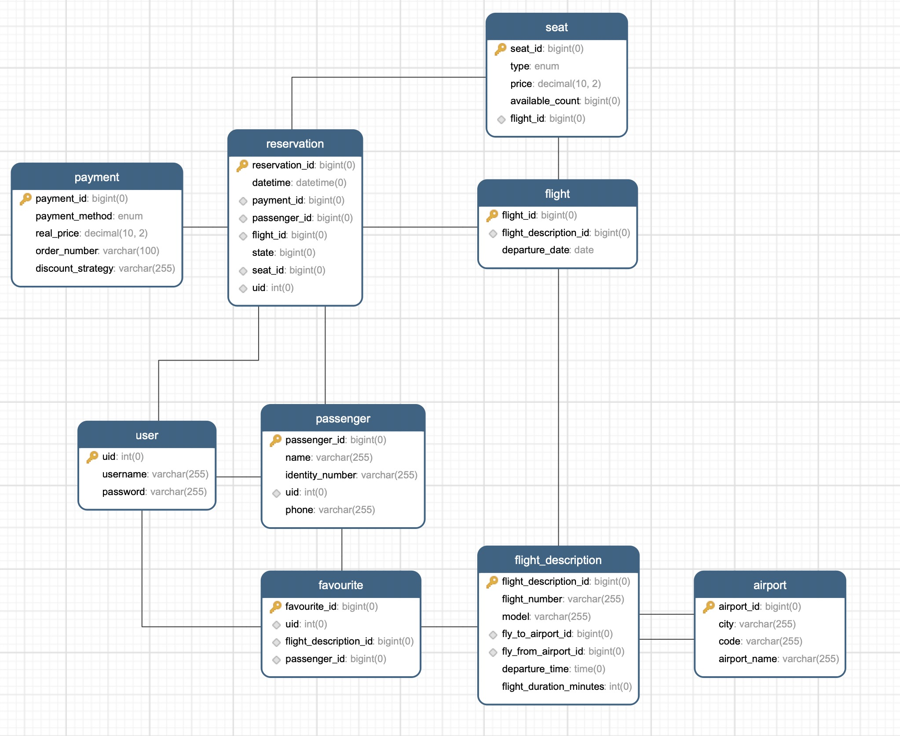

# Plane Reservation 设计文档

## 需求变更说明

和旧版的机票订购系统相同，本小组继续采用 SpringBoot 和 Java Swing 开发系统。在原有系统的基础上拓展了若干接口、控制器和模型类。最终实现了要求的 7 个需求变更中的 6 个，即：

1. 允许票价随时间和人数的多少进行变动
2.  允许票价在特定时间段打折，支持多种折扣方式
3. 支持一键抢票
5. 当不同航空公司票价打折时，将通知关注的人
6. 进度跟踪
7. 订单的历史纪录显示

变更需求后的类图如下图所示（新增部分用红色表示。文字较小，我们同时也附上了未压缩的原图）：

变更后的领域模型如下图所示：

需求变更后，为了配合代码实现，数据库也进行了修改，修改后的 ER 图如下所示。进行的修改主要是增加了 favourite 表和 payment 里的 discount_strategy，为了实现一键抢票及多种折扣策略。

## 详细说明及设计模式

### 1. 允许票价随时间和人数变动

策略模式 定价策略 Pricing Strategy

### 2. 票价在特定时间段打折

折扣策略 Discount Strategy，工厂（？？？

### 3. 一键抢票

新页面

### 4. 打折时通知关注人

Discount Dispatcher，Listener，观察者模式

### 5. 进度追踪

观察者模式，新页面

### 6. 订单历史记录显示

## 项目效果展示

具体详细的效果展示，可以详见附件录制的视频。项目中的大多数界面均有变更，这里摘取部分截图如下：

登录界面

主页（订单查询页面，左下角为最新的折扣消息）：

创建订单界面：

以下是旧的新建订单界面。相比旧版本（如下图）新增了折扣功能选项。

历史订单界面：

以下是旧版本的历史订单界面。相比旧版本，新版本增加了订单记录追踪功能，取消订单功能和添加到一键抢票功能。

支付界面

支付完成的消息提示

添加到一键抢票的提示：

从一键抢票中删除的确定提示：

一键抢票页面，可以根据历史订单中的配置快速选择和之前购买过的订单相同的配置，直接进入支付页面：

 

其中快速选择机票配置的选择框如下图所示：

