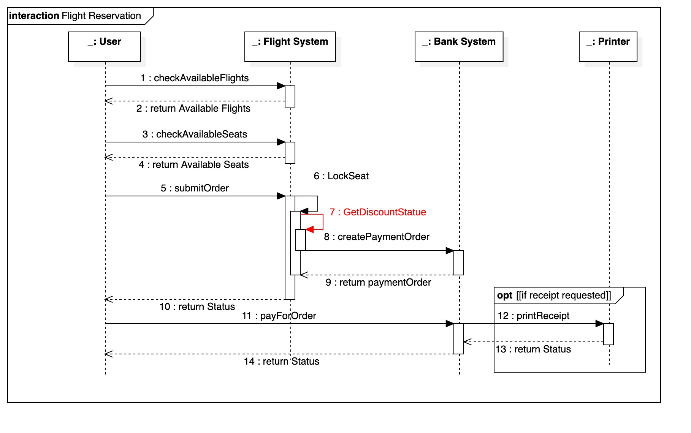
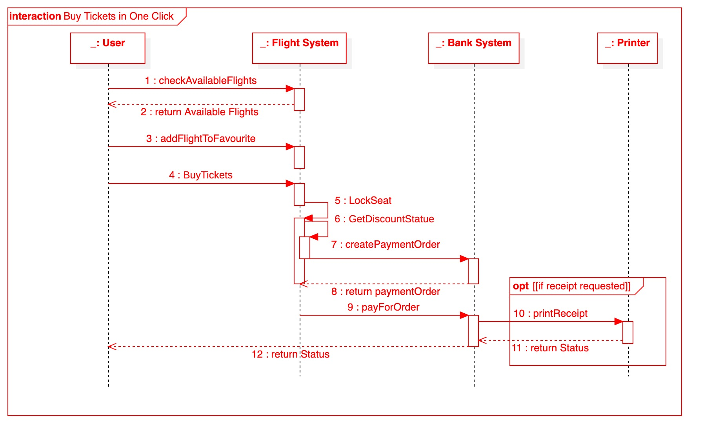
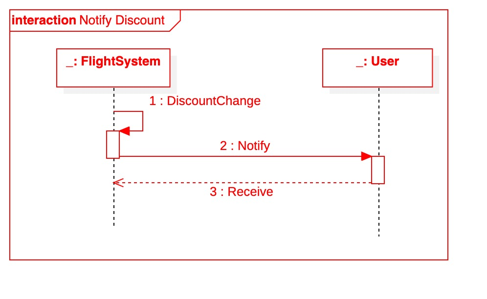
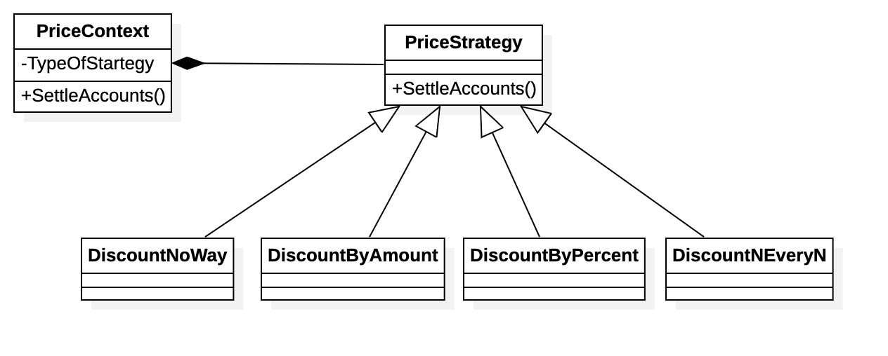
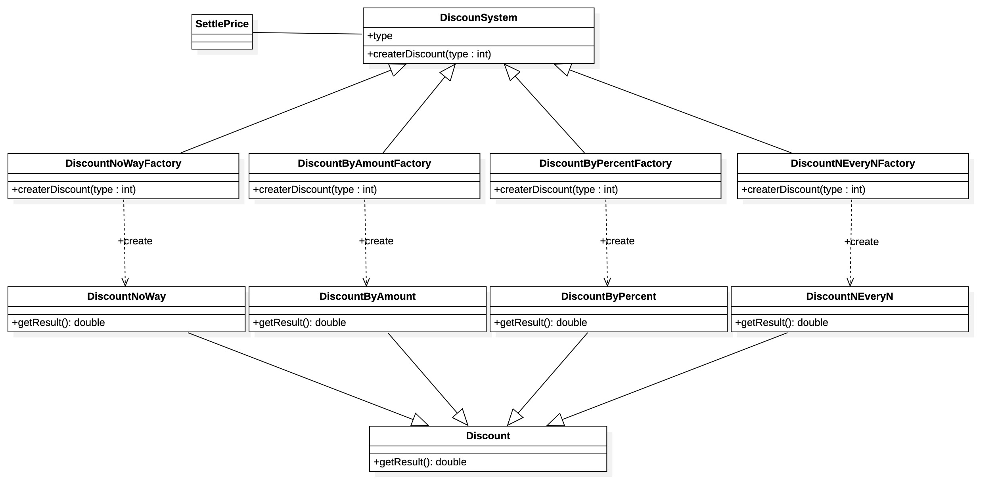
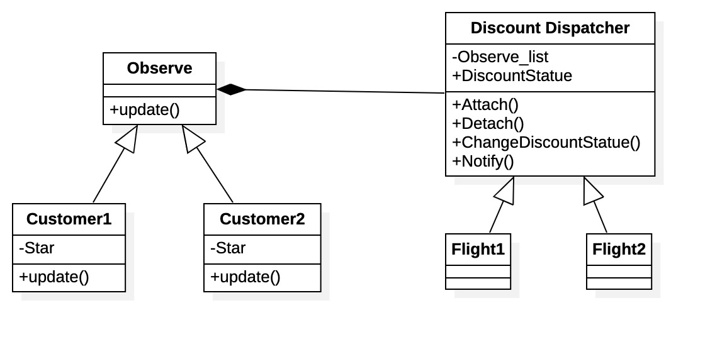
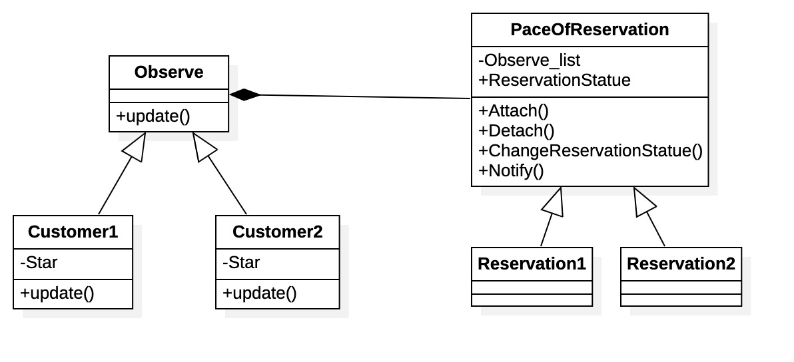
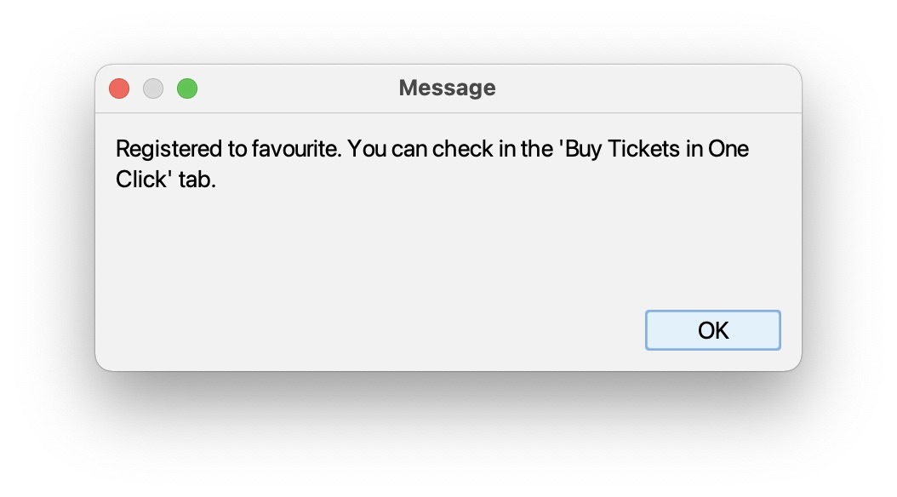

# Plane Reservation 设计文档

## 需求变更说明

和旧版的机票订购系统相同，本小组继续采用 SpringBoot 和 Java Swing 开发系统。在原有系统的基础上拓展了若干接口、控制器和模型类。最终实现了要求的 7 个需求变更中的 6 个，即：

1. 允许票价随时间和人数的多少进行变动
2.  允许票价在特定时间段打折，支持多种折扣方式
3. 支持一键抢票
5. 当不同航空公司票价打折时，将通知关注的人
6. 进度跟踪
7. 订单的历史纪录显示

变更需求后的类图如下图所示（新增部分用红色表示。文字较小，我们同时也附上了未压缩的原图）：

变更后的领域模型如下图所示：

再需求发生变更后，发生变化的交互图有：

#### 机票预订

#### 一键抢票

#### 打折通知

需求变更后，为了配合代码实现，数据库也进行了修改，修改后的 ER 图如下所示。进行的修改主要是增加了 favourite 表和 payment 里的 discount_strategy，为了实现一键抢票及多种折扣策略。

## 详细说明及设计模式

### 1. 允许票价随时间和人数变动

这一部分中，票价随时间、人数变动设计和实现，我们使用策略模式帮助设计。

策略模式定义了一系列算法，并将每个算法封装起来，而且使得它们可以相互替换，策略模式让算法和使用它的客户端而独立变化。

于是根据这个，我们可以得到设计方案：需要设计一个接口，为一系列实现类提供统一的方法，多个实现类实现该接口；设计一个抽象类，泛化出多个具体策略类，具体的策略类负责策略的具体实现。

在这边，我们考虑两种不同的变化方式，“随时间变化（PriceDependTime）”（例如，飞海南的飞机票冬天的普遍要比夏天的价格高、晚上深夜起飞的飞机价格普遍要比下午起飞的飞机价格高）和“随人数变化（PriceDependPerson）”（例如，航班根据历史过去几天同航班的购买人数数量做出响应价格的变化）。

这三个具体的策略都继承父类"价格策略（PriceStrategy）"，并且 overwrite 操作 "计算价格（SettlePrice）"。

最后建立一个上下文类“PriceContext”，其有属性 "计算价格类型（TypeOfStartegy）"，用来决定如何选择价格计算，还有一个操作 "计算价格（SettlePrice）"，通过调用"价格策略（PriceStrategy）"的"计算价格（SettlePrice）"来获得价格的计算结果。

根据上述的设计方案，可以得到如下的类图：

### 2. 票价在特定时间段打折

同样在，这一部分中，打折的设计和实现，我们也使用策略模式帮助设计。

在这边，我们考虑三种不同的结算方式："无折扣付款（DiscountNoWay）","抵金券结算（DiscountByAmount）", "打折结算（DiscountByPercent）", "满减结算（DiscountNEveryN）"。

这三个具体的策略都继承父类"打折策略（DiscountStrategy）"，并且 overwrite 操作 "结算（SettleAccounts）"。

最后建立一个上下文类“DiscountContext”，其有属性 "结算策略类型（TypeOfStartegy）"，用来决定如何选择结算策略，还有一个操作 "结算（SettleAccounts）"，通过调用"打折策略（DiscountStrategy）"的"结算（SettleAccounts）"来获得结算结果。

根据上述的设计方案，可以得到如下的类图：

同时，我们针对打折的方式，还使用了工厂模式进行辅助设计分析。

在我们的系统中，会根据相应的不同时间产生不同的打折计算方式，在此策略下得到的设计方案，有如下类图：

### 3. 一键抢票

我们设计了一个独立的界面来完成一键抢票的功能，具体效果可以详见下文的效果展示和附件中视频展示的效果。

### 4. 打折时通知关注人

这一部分中，打折时通知关注人的设计和实现，我们使用观察者模式帮助设计。

用观察者模式的角度来设计分析，显然此时的关注人是观察者，观察的事务是机票的打折变化。考虑到不同的人会关注不同的航班价格变化，于是我们设计一个类 Observer 具有抽象的 “更新（update）” 函数，用来更新关注事务的状态。关注人继承类 Observer 并拥有属性“关注（Star）”记录关注的航班状态。我们同时创建一个类 “打折（Discount Dispatcher）”用来继承出不同的具体航班，具体航班的类中记录观察者列表。

根据以上信息设计出的类图如下所示：

最终实现的效果如下所示：

### 5. 进度追踪

和上一部分类似的，进度追踪中我们也使用了观察者模式进行辅助设计，设计出的类图如下所示：

同时我们为进度追踪设计了新的独立新页面，效果如下：

### 6. 订单历史记录显示

## 项目效果展示

具体详细的效果展示，可以详见附件录制的视频。项目中的大多数界面均有变更，这里摘取部分截图如下：

登录界面

主页（订单查询页面，左下角为最新的折扣消息）：

创建订单界面：

以下是旧的新建订单界面。相比旧版本（如下图）新增了折扣功能选项。

历史订单界面：

以下是旧版本的历史订单界面。相比旧版本，新版本增加了订单记录追踪功能，取消订单功能和添加到一键抢票功能。

支付界面

支付完成的消息提示

添加到一键抢票的提示：

从一键抢票中删除的确定提示：

一键抢票页面，可以根据历史订单中的配置快速选择和之前购买过的订单相同的配置，直接进入支付页面：

 

其中快速选择机票配置的选择框如下图所示：

