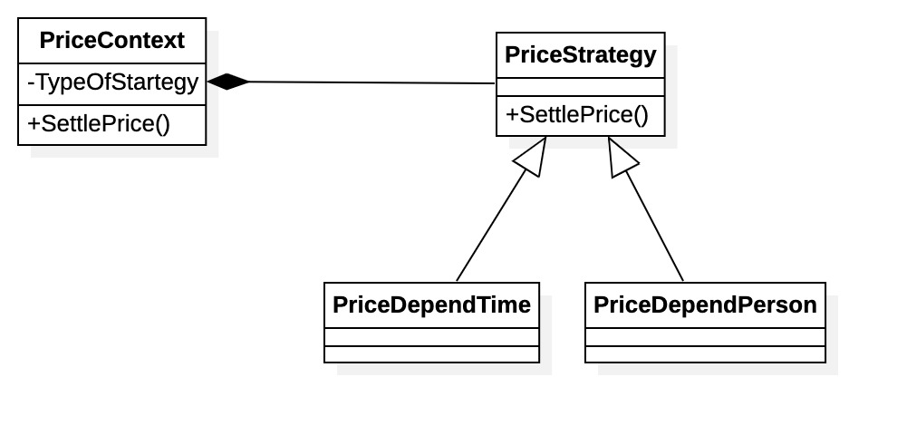

# Plane Reservation 设计文档

## 需求变更说明

和旧版的机票订购系统相同，本小组继续采用 SpringBoot 和 Java Swing 开发系统。在原有系统的基础上拓展了若干接口、控制器和模型类。最终实现了要求的 7 个需求变更中的 6 个，即：

1. 允许票价随时间和人数的多少进行变动
2.  允许票价在特定时间段打折，支持多种折扣方式
3. 支持一键抢票
5. 当不同航空公司票价打折时，将通知关注的人
6. 进度跟踪
7. 订单的历史纪录显示

变更需求后的类图如下图所示（新增部分用红色表示。文字较小，我们同时也附上了未压缩的原图）：

变更后的领域模型如下图所示：

再需求发生变更后，发生变化的交互图有：

#### 机票预订

#### 一键抢票

#### 打折通知

需求变更后，为了配合代码实现，数据库也进行了修改，修改后的 ER 图如下所示。

相比先前的数据库设计，本次需求变更进行的修改主要是增加了 favourite 表和 payment 里的 discount_strategy，为了实现一键抢票及多种折扣策略。favourite 表作为用户关注的航班，外键关联了用户、航班描述符和乘客信息。

于是数据库中的各表的主要作用如下：

| Table              | Usage                                                    |
| ------------------ | -------------------------------------------------------- |
| payment            | 记录了每笔订单的支付记录和折扣策略                       |
| reservation        | 用户的预定记录，航班信息与出发日期等                     |
| user               | 系统的用户                                               |
| passenger          | 保存的乘客信息，包括身份证号、手机联系方式等             |
| flight_description | 航班描述符，指定了航班的基本信息                         |
| flight             | 具体的航班排表信息，如同一个航班号在不同日期的具体实例   |
| seat               | 和每一个具体航班相关联的仓位即及价格信息                 |
| airport            | 记录了机场的城市、代码等信息                             |
| favourite          | 用户关注的航班列表及相关联的乘客，用于一键抢票和折扣通知 |

## 详细说明及设计模式

### 1. 允许票价随时间和人数变动

这一部分中，票价随时间、人数变动设计和实现，我们使用策略模式帮助设计。策略模式定义了一系列算法，并将每个算法封装起来，而且使得它们可以相互替换，策略模式让算法和使用它的客户端而独立变化。

于是根据该思想，我们可以得到设计方案：需要设计一个接口，为一系列实现类提供统一的方法，多个实现类实现该接口；设计一个抽象类，泛化出多个具体策略类，具体的策略类负责策略的具体实现。

在这边，我们考虑两种不同的变化方式，「随时间变化（PriceDependTime）」（例如，飞海南的飞机票冬天的普遍要比夏天的价格高、晚上深夜起飞的飞机价格普遍要比下午起飞的飞机价格高）和「随人数变化（PriceDependPerson）」（例如，航班根据历史过去几天同航班的购买人数数量做出响应价格的变化）。

这三个具体的策略都继承父类**「定价策略 `PriceStrategy`」**，并且 override 操作 "计算价格（SettlePrice）"。

最后建立一个上下文类「PriceContext」，其有属性 "计算价格类型（TypeOfStartegy）"，用来决定如何选择价格计算，还有一个操作 "计算价格（SettlePrice）"，通过调用"价格策略（PriceStrategy）"的"计算价格（SettlePrice）"来获得价格的计算结果。

根据上述的设计方案，可以得到如下的类图：

### 2. 票价在特定时间段打折

同样在，这一部分中，打折的设计和实现，我们也使用策略模式帮助设计。

在这边，我们考虑三种不同的结算方式：「无折扣付款 `DiscountNoWay`」,「抵金券结算``DiscountByAmount`」, 「打折结算 `DiscountByPercent`」, 「满减结算`DiscountNEveryN`」。

这三个具体的策略都继承父类**「折扣策略（Discount Strategy）」**，并且 override 操作 "结算（SettleAccounts）"。

最后建立一个上下文类「PriceContext」，其有属性 "结算策略类型（TypeOfStartegy）"，用来决定如何选择结算策略，还有一个操作 "结算（SettleAccounts）"，通过调用"结算策略（PriceStrategy）"的"结算（SettleAccounts）"来获得结算结果。

根据上述的设计方案，可以得到如下的类图：

同时，我们针对打折分发方式，设计了一个 `DiscountSystem`。该子系统实际上参考了**工厂模式**的设计思路，各个席位都将通过该子系统根据航班等级、飞机型号、航空公司等信息从 `DiscountSystem` 中拿到相应的折扣策略，取到不同的继承了 `DiscountStrategy` 的具体实现。

在我们的系统中，会根据相应的不同时间产生不同的打折计算方式，在此策略下得到的设计方案，有如下类图：

折扣的选择有两种方式，第一种通过首页选择航班，进入 ReservationDialogue 选择折扣，右下角会显示出折扣的折扣有效时间的倒计时：

另一种方式是通过一键抢票页面选择折扣方式，将在后文描述。

### 3. 一键抢票

我们设计了一个独立的界面来完成一键抢票的功能，具体效果可以详见下文的效果展示和附件中视频展示的效果。抢票界面的配置来自于从历史订单中选择「Add to Favourite」。一键抢票包含的信息有航班号，也就是 `FlightDescription` 和相关联的乘客信息。用户只需要选择日期、席位和实时的打折策略即可直接进入支付页面，快速购买机票，简化了购票流程。

该页面同时也是 `DiscountDispatcher` 的 Listener，在航班折扣信息发生改变时会刷新可用的折扣方案，提示用户重新做选择。

值得一提的是，在 View 层，为了使用 Java Swing 实现确认对话框（如移除关注的提示、确认支付的提示），我们对 View 设计了 `ConfirmableFrame` 和 `PaymentConfirmable` 接口，使得实现了这些接口的 Panel 能够作为 ConfirmDialogue 和 PaymentDialogue 的 `masterFrame`，从而实现信息的回调，让主窗口能够获取到用户在子通知窗口做出的选择。在本次需求变更中新增的 `FavouritePanel` 就实现了这两个接口。实现该逻辑的主要类图如下图所示：

### 4. 打折时通知关注人

这一部分中，打折时通知关注人的设计和实现，我们使用观察者模式帮助设计。

用观察者模式的角度来设计分析，显然此时的关注人是观察者，观察的事务是机票的打折变化。考虑到不同的人会关注不同的航班价格变化，于是我们设计一个类 Observer 具有抽象的 「更新（update）」 函数，用来更新关注事务的状态。关注人继承类 Observer 并拥有属性「关注（Star）」记录关注的航班状态。我们同时创建一个类 「打折（Discount Dispatcher）」用来继承出不同的具体航班，具体航班的类中记录观察者列表。

在本系统中，首页 `MainPanel` 和一键抢票页面 `FavouratePanel` 都是 `DiscountDispatcher` 的 Listener，用于在折扣发生变动时更新界面上可用的折扣信息和计算出来的价格信息。为了方便展示，我们默认采用的折扣分发方式是在每分钟的前 30s 内有折扣，在每分钟的 30 - 60 s 时没有折扣。所以在每分钟的 30s 和 60s 都会触发 Listener 的事件。

根据以上信息设计出的类图如下所示：

最终实现的效果如下所示。如果用户将某个特定订单 Add to Favourite，那么该订单的航班在打折时就会出现在首页的打折提示上：

相对应的，在没有折扣可用时会显示如下信息：

为了演示，我们只是设置了首页的文字信息。在实际的系统中，可以对 `onDiscountOpened` 和` onDiscountClosed` 方法进行拓展开发，而实现真正的通知功能。

### 5. 进度追踪

和上一部分类似的，进度追踪中我们也使用了观察者模式进行设计，设计出的类图如下所示：

该页面会作为一个 Listener 监听订单的更新事件，在订单状态发生更新时会调用 `onReservationStatusUpdated` 方法来通知顾客。为了演示作用我们只在控制台输出了订单状态的更新提醒，在实际的应用中可以对该方法进行拓展实现。

同时我们为进度追踪设计了新的独立新页面，效果如下：

### 6. 订单历史记录显示

我们设计了 Reservation History 界面来允许用户查询历史订购信息。用户可以根据日期范围、乘客姓名、订单状态等信息进行筛选，右侧则会展示出当前选择的订单的所有详细信息。右下角的提示作为订单记录追踪功能。

除了简单的展示功能以外，订单历史记录页面还允许用户取消订单（取消的订单会用斜体表示），以及允许用户将当前订单的航班配置添加至关注列表，后续可以一键抢票，也会在该航班打折时收到折扣的文字提示。

## 项目效果展示

具体详细的效果展示，可以详见附件录制的视频。项目中的大多数界面均有变更，这里摘取部分截图如下。

此外，本次项目使用 GitHub 协作开发，项目托管地址：https://github.com/BillChen2K/PlaneReservation

登录界面

用户不存在 / 密码错误的提示：

主页（订单查询页面，左下角为最新的折扣消息）：

创建订单界面：

以下是旧的新建订单界面。相比旧版本（如下图）新增了折扣功能选项。

历史订单界面：

以下是旧版本的历史订单界面。相比旧版本，新版本增加了订单记录追踪功能，取消订单功能和添加到一键抢票功能。

支付界面

支付完成的消息提示

添加到一键抢票 / 添加关注航班的消息提示：

从一键抢票中删除的确定提示：

一键抢票页面，可以根据历史订单中的配置快速选择和之前购买过的订单相同的配置，直接进入支付页面：

 

其中快速选择机票配置的选择框如下图所示：

关于界面

---

2021.1.10 (Sun.)